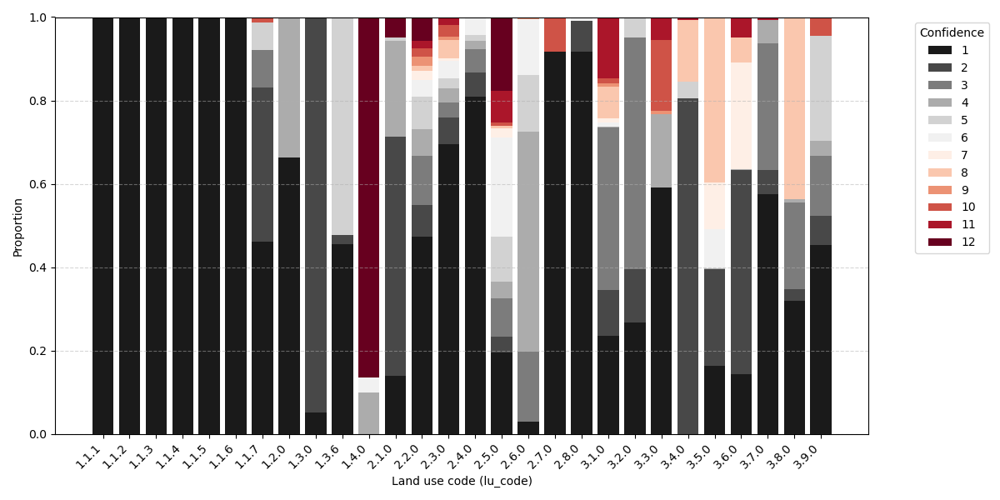
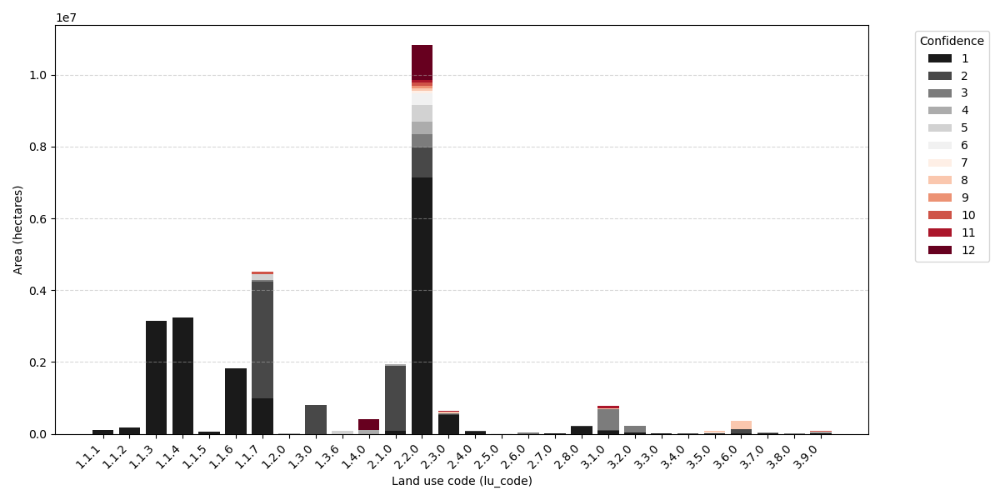
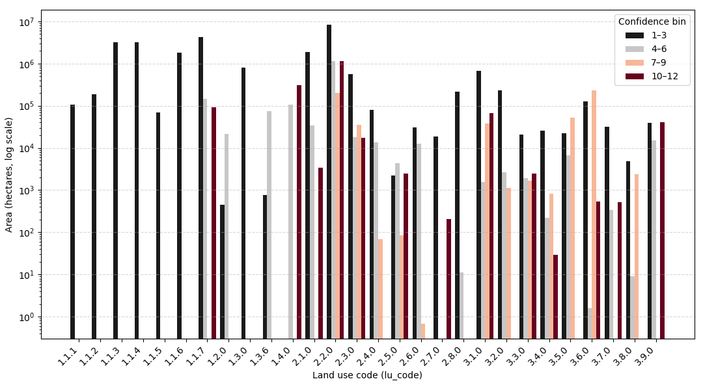
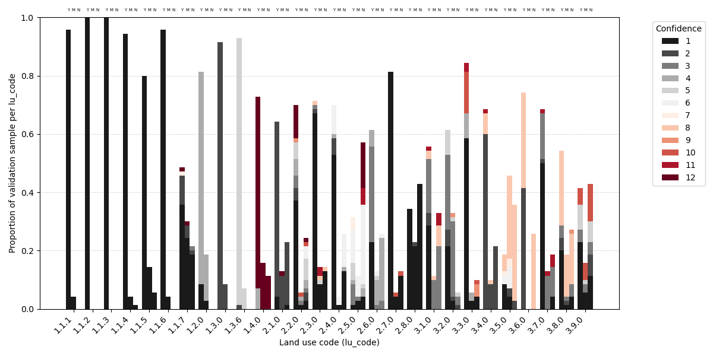

```bash
./confidence_results.py ./nzlum.multipolygon.20250514.gpkg --by proportion
./confidence_results.py ./nzlum.multipolygon.20250514.gpkg --by area
./confidence_results.py ./nzlum.multipolygon.20250514.gpkg --by area --log
```

```bash
./stratified_sample_results.py ./nzlum.urban_rural_2025_validation/nzlum.urban_rural_2025_merged.gpkg
```






