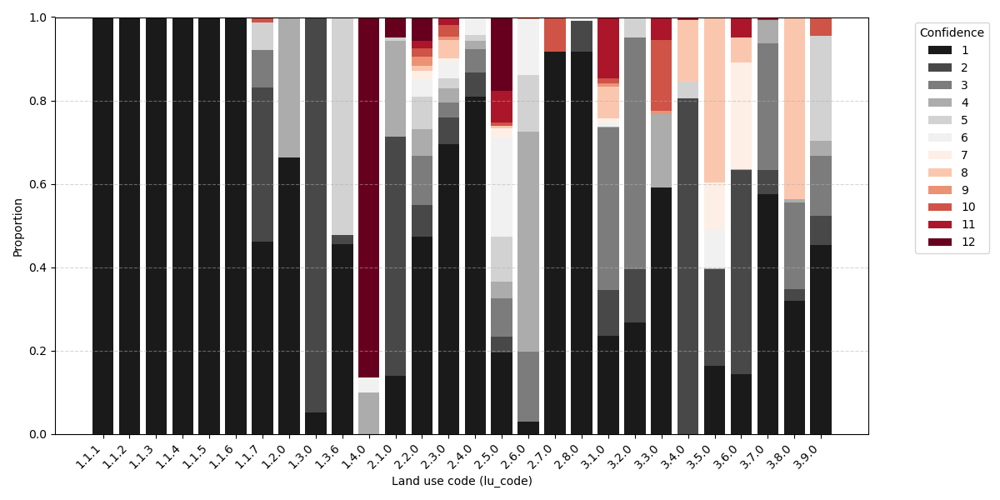
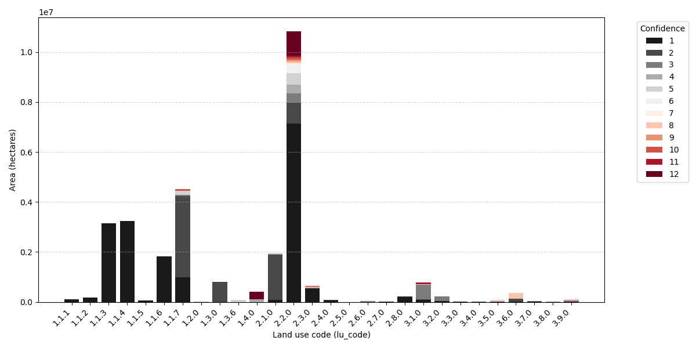
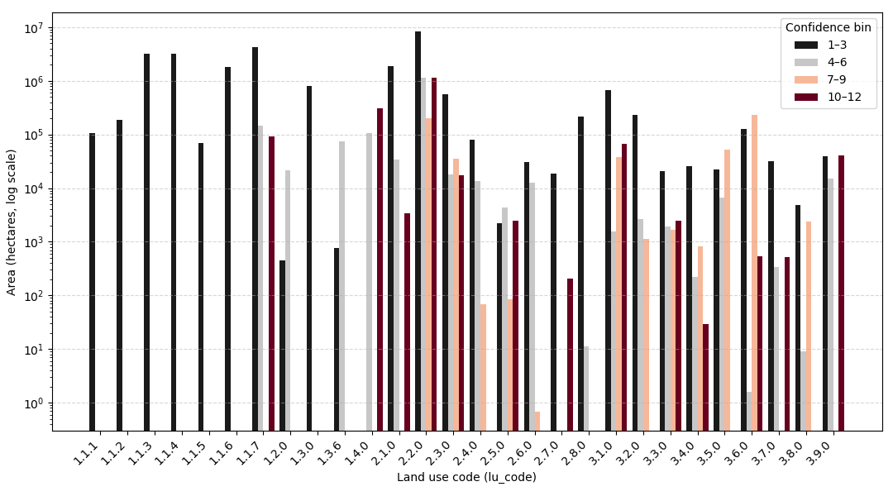
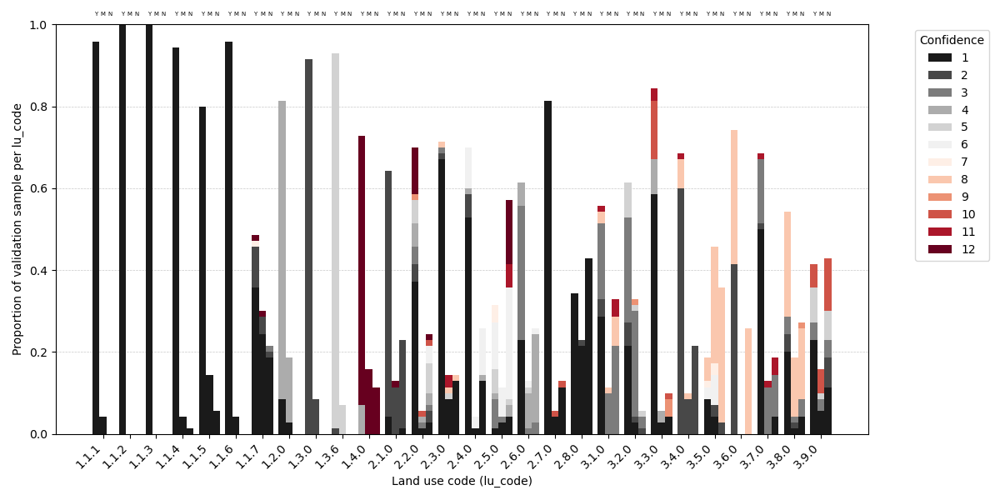

```bash
python ./confidence_results.py ./nzlum.multipolygon.20250514.gpkg --by proportion
python ./confidence_results.py ./nzlum.multipolygon.20250514.gpkg --by area
python ./confidence_results.py ./nzlum.multipolygon.20250514.gpkg --by area --log
```

```bash
python ./stratified_sample_results.py ./nzlum.urban_rural_2025_validation/nzlum.urban_rural_2025_merged.gpkg --truth_col validated
```







## validation_accuracy.py

Three-panel summary of stratified validation sample results against a GeoPackage with validation attributes.

```bash
python ./validation_accuracy.py input.gpkg \
  --truth-col validation \
  --true-values trueTertiary \
  --secondary-values trueSecondary \
  --maybe-values maybe \
  --threshold 0.8 \
  --output summary.png
```

**Panel 1 — Confidence calibration:** Area-weighted stacked bars showing proportion of each validation outcome per confidence score (1 = most confident). Reveals whether the classifier is "confidently wrong" — false proportion should be low at score 1 and rise toward score 12.

**Panel 2 — Tertiary accuracy:** Per-class area-weighted accuracy where strict = `trueTertiary` only. Classes are shown at their full tertiary resolution (e.g. `2.2.3`). Error bars are bootstrap confidence intervals (default 95%, 1000 resamples) from resampling polygons within each class. Filled dot = strict accuracy; hollow dot = lenient accuracy (adds `maybe`); connecting line shows how much `maybe` matters. Colour indicates whether the CI is clearly above (green), clearly below (red), or straddles (amber) the accuracy threshold.

**Panel 3 — Secondary accuracy:** Same as panel 2 but tertiary classes are rolled up to their secondary parent (last code component set to 0, e.g. `2.2.3` → `2.2.0`). Strict accuracy includes both `trueTertiary` and `trueSecondary` at this level.

**Area weighting:** All proportions weight by polygon area, not polygon count. A large correctly-mapped polygon counts more than a small one — appropriate for assessing map accuracy. Bootstrap CIs reflect this: a class dominated by one consistently-correct large polygon will show a narrow CI.

Key options:

| Flag | Default | Purpose |
|---|---|---|
| `--truth-col` | `validation` | Attribute column holding validation outcome |
| `--true-values` | `trueTertiary` | Values counted as correct at tertiary level |
| `--secondary-values` | `trueSecondary` | Values additionally correct at secondary level |
| `--maybe-values` | `maybe` | Values counted as correct in lenient view only |
| `--threshold` | `0.8` | Accuracy threshold line |
| `--ci` | `0.95` | Bootstrap CI level |
| `--bootstrap-n` | `1000` | Number of bootstrap resamples |
| `--area-col` | *(geometry)* | Area column; defaults to `geometry.area` |
| `--null-class` | *(first sorted)* | Class code to treat as null/unclassified |
| `--include-null-class` | False | Include null class in plots |
| `--a4` | False | Constrain output to A4 landscape (11.69×8.27in, 300dpi) for print |
